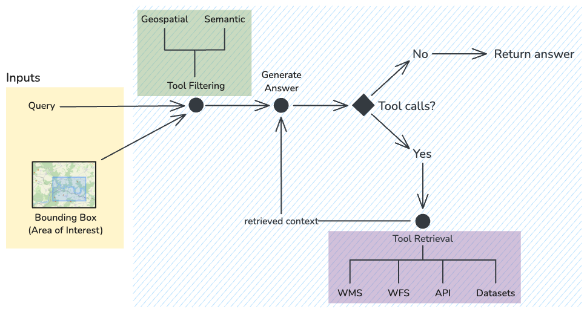

# Enhancing LLM Performance Through an Agentic Approach in Retrieval-Augmented Generation

This repository contains the implementation of **GeoChat Assistant**, an agentic LLM system that integrates external tools for interactive geospatial data processing. Built on the LangGraph framework, it enables dynamic tool invocation for spatial analysis and data retrieval from sources like WMS and public APIs. The system supports natural language queries over user-defined areas and is designed to enhance reasoning and functionality in geospatial tasks.

## System overview
This diagram shows the workflow of the GeoChat Assistant. It is implemented using LangGraph's state graph that manages the input processing, tool selection, tool invocation and final response generation.



## Project structure
Here is the overview of the project structure:
- /
  - `data` *(Data used by the tools)*
  - `src` *(GeoChat Assistant source files)*
    - `agents` *(Module with agent classes and LangGraph workflows)*
    - `config` *(Configurations for WMS, WFS and project constants)*
    - `schemas` *(Models for data and geometry handling)*
    - `tools` *(Tool suite implementation)*
    - `utils` *(General module for project utils)*
    - `visualizations` *(Components for Folium map)*
    - *app.py* (Main entrypoint for the Streamit application)

The implementation is inside the `src` folder, the application can be run with *streamlit* and the project can be install from the `pyproject.toml` file.

## Running the application
**Prerequisites:**
- Python 3.9 or higher
- pip
- Ollama or API keys for OpenAI / Groq / Google AI Studio

### Installation and Setup

1. **Clone the Repository**\
    Clone the GeoChat repository to your local machine:

   ```bash
   git clone https://github.com/k4kTuS/DPGeoChat.git
   cd geochat
   ```

2. **Set Up a Virtual Environment (Recommended)**\
    It is recommended to create and activate a virtual environment for the project. Below is an example using the *venv module*:

    ```bash
    python -m venv venv
    source venv/bin/activate
    ```

3. **Install dependencies from `pyproject.toml` file**
    ```bash
    # Install the project and its dependencies
    pip install .
    # Or for editable/development mode
    pip install -e .
    ```

    Installing from the project file allows for easy importing of the application modules.

4. **Setup streamlit secrets**\
    Streamlit uses a `secrets.toml` file for variables that are loaded into the environment when the application starts. You can copy the `secrets.toml.sample` file and set the variables.

    ```bash
    cp .streamlit/secrets.toml.sample .streamlit/secrets.toml
    ```

    The default content of the file looks like this:

    ```toml
    # All variables are automatically loaded into environ by streamlit under the same key
    # API keys for LLM providers
    OPENAI_API_KEY="YOUR_OPENAI_API_KEY"
    GROQ_API_KEY="YOUR_GROQ_API_KEY"
    GOOGLE_API_KEY="YOUR_API_KEY"

    # Local LLM configuration
    OLLAMA_API_URL="http://localhost:11434"

    # LangSmith logging configuration
    LANGCHAIN_API_KEY="YOUR_LANGCHAIN_API_KEY_FOR_LANGSMITH"
    LANGCHAIN_ENDPOINT="https://api.smith.langchain.com"
    LANGCHAIN_TRACING_V2="true"
    LANGCHAIN_PROJECT="YOUR_PROJECT_NAME"

    # Early access password
    EA_PASSWORD="EARLY_ACCESS_PASSWORD"

    # Application settings
    LOCK_LLM_SELECTION=true  # Restrict users to the default LLM provider
    DEV_MODE=false           # Disable early access login screen in development
    ```

    **Notes:**
   - The `OPENAI_API_KEY`, `GROQ_API_KEY`, `GOOGLE_API_KEY` are required only if you plan to use the respective LLM providers.
   - If you want to use models hosted by Ollama, set `OLLAMA_API_URL` to the URL you are using.
   - The `LANGCHAIN_API_KEY` and other LangChain variables are needed only if you plan to use LangSmith logging
   - The `EA_PASSWORD` variable is used for a simple early access mechanism, requiring users to enter a global password to access the app.
   - Set `LOCK_LLM_SELECTION` to `true` to restrict users to a single LLM provider in hosted environments.
   - Enable `DEV_MODE` by setting it to `true` to bypass the early access login screen during development.
   - Ensure all text-like variables are enclosed in quotes.

5. **Setup environment variables**
    You can also use the core agent and tool modules interactively in notebooks or scripts without launching the UI. Simply import from *src.agents* or *src.tools*. For this, it is important to setup the `.env` file which sets the necessary environment variables to be loaded using the *python-dotenv* library.

    ```bash
    cp .env.sample .env
    ```

6. **Starting the Streamlit application**\
    To run the application, simply start it by using:
    ```bash
    streamlit run ./src/app.py
    ```
    The application will by default be accessible at `http://localhost:8501/`.
    

## Citation
If you find use for this work, you can cite it in the following BibTeX format:
```
@thesis{botek2025agentic,
  author      = {Matúš Botek},
  title       = {Enhancing LLM Performance Through an Agentic Approach in Retrieval-Augmented Generation},
  type        = {Master's thesis},
  institution = {Czech Technical University in Prague, Faculty of Information Technology},
  year        = {2025},
  location    = {Prague},
}
```
